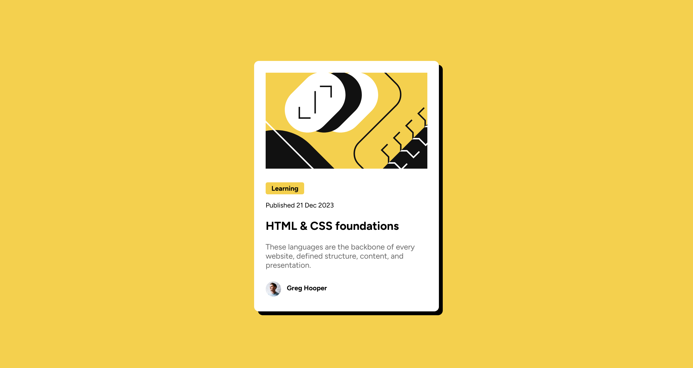

# Frontend Mentor - Blog preview card solution

This is a solution to the [Blog preview card challenge on Frontend Mentor](https://www.frontendmentor.io/challenges/blog-preview-card-ckPaj01IcS). Frontend Mentor challenges help you improve your coding skills by building realistic projects. 

## Table of contents

- [Overview](#overview)
  - [The challenge](#the-challenge)
  - [Screenshot](#screenshot)
  - [Links](#links)

## Overview
This HTML & CSS-only challenge is a project for getting up to speed with HTML and CSS fundamentals, like HTML structure and the box model.

### The challenge

Users should be able to:

- See hover and focus states for all interactive elements on the page

### Screenshot

### Links

- Solution URL: (https://github.com/khanwelcomes/frontend.git)
- Live Site URL: (https://khanwelcomes.github.io/frontend/blog-preview-card-main/index.html)

### Built with

- Semantic HTML5 markup
- CSS custom properties
- Flexbox
