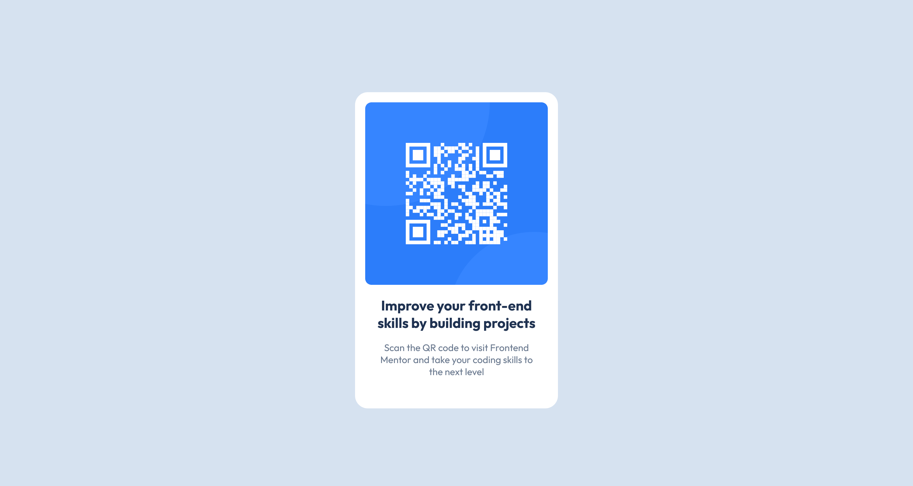

# Frontend Mentor - QR code component solution

This is a solution to the [QR code component challenge on Frontend Mentor](https://www.frontendmentor.io/challenges/qr-code-component-iux_sIO_H). Frontend Mentor challenges help you improve your coding skills by building realistic projects. 

## Table of contents

- [Overview](#overview)
  - [Screenshot](#screenshot)
  - [Links](#links)
- [My process](#my-process)
  - [Built with](#built-with)

**Note: Delete this note and update the table of contents based on what sections you keep.**

## Overview
- This is a beginner HTML and CSS challenge which comprises of designing a card layout with a QR-code image and some text.

### Screenshot

### Links

- Solution URL: [Add solution URL here](https://your-solution-url.com)
## My process
- First I have divided the required output into divisions of image and text present in an overall container.
- Then I have used the CSS Flexbox to design the centered layout.
- Finally, I have done appropriate CSS styling usung the Figma design.

### Built with

- Semantic HTML5 markup
- CSS custom properties
- Flexbox
- [Styled Components][Outfit](https://fonts.google.com/specimen/Outfit)

