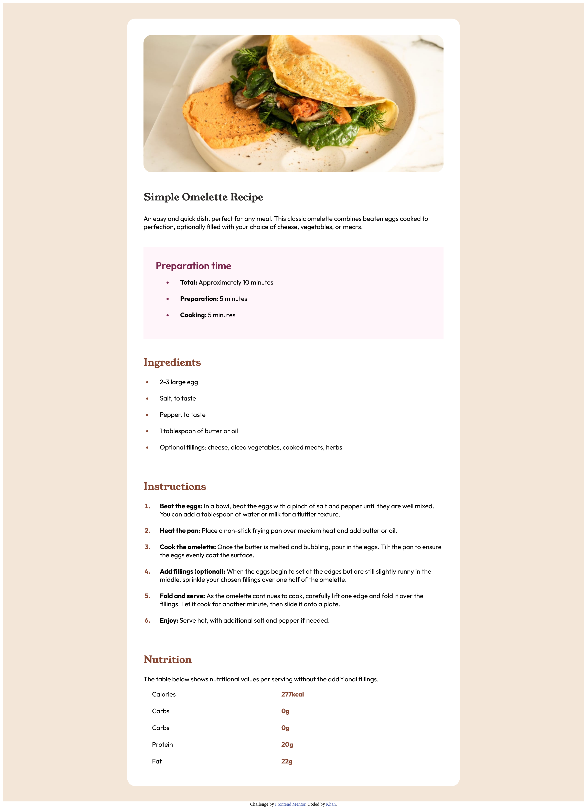

# Frontend Mentor - Recipe page solution

This is a solution to the [Recipe page challenge on Frontend Mentor](https://www.frontendmentor.io/challenges/recipe-page-KiTsR8QQKm). Frontend Mentor challenges help you improve your coding skills by building realistic projects. 

## Table of contents

- [Overview](#overview)
  - [The challenge](#the-challenge)
  - [Screenshot](#screenshot)
  - [Links](#links)

**Note: Delete this note and update the table of contents based on what sections you keep.**

## Overview
This challenge will focus on writing semantic HTML Ensuring to think through what HTML elements are most appropriate for each piece of content.
### Screenshot

### Links

- Solution URL:  https://github.com/khanwelcomes/frontend.git
- Live Site URL: https://khanwelcomes.github.io/frontend/recipe-page-main/index.html

## My process

### Built with

- Semantic HTML5 markup
- CSS custom properties
- Flexbox
- CSS Grid

